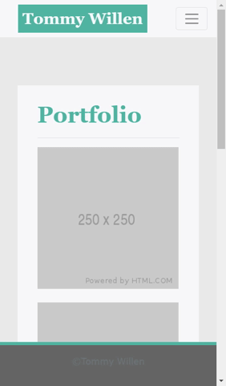

# Responsive-Portfolio

Explore the github [project repo](https://github.com/TommyWillen/Responsive-Portfolio)

View the [github-pages](https://tommywillen.github.io/Responsive-Portfolio/)

## Table of Contents

- [Project Description](#Project-Description)
    - [Utilization of Bootstrap Library](#utilization-of-bootstrap-library)
    - [Responsive Website and Features](#Responsive-website-and-features)
    - [Video Tutorial](#video-tutorial)

- [Installation](#installation)

- [Roadmap](#roadmap)

- [License](#license)

- [Contact Me](#contact-me)

- [Acknowledgements](#acknowledgements)

## Project Description

The purpose of this project was to utilize the Bootstrap framework to develop a website that was responsive to various screen sizes ranging from mobile to desktop so that any user who accesses the site would view an aesthetically appealing design. I also made sure to take what I learned about in my last project to include semantic HTML elements to better accessibility.

### Utilization of Bootstrap Library


In the image above you can my liberal use the the Bootstrap framework when creating this project. To start you can see the header and footer which utilize their navbar components. I also incorporated their navbar collapse and fixed features which will be detailed more in the next subsection.

The main content of the page is housed inside one of their card elements which is housed inside one a column using their grid system. I also included their spacing classes heavily to create effective positioning of text, images, padding to account for aesthetics and to acount for the displacement made by the fixed header and footer.

The only elements I used my own stylesheet for were the fonts, colors, and padding/margining that the framwork could not handle.

### Responsive Website and Features




The above three gifs demonstrate what the three pages look like when resized. There are a total of three different states that can be seen in each page. The first is for large screens \(992px and greater\). The second is for medium sized screens \(\<992px  \>767px\). The third is for small and lower sized screens \(\<768px\).

At the start of resizing you will notice that the card \(main content\) does not change but the far left and right margins decrease. At the first breakpoint, the most noticeable change is card size shrinks.

The less noticeable change is the top navigation buttons collapse into a hamburger button. The what it looks like can be better seen in the two gifs below.


At the second breakpoint, the card takes up the majority of the width removing most of the right margin seen in the previous aspect ranges. The length of the forms in the contact page increase in length at the breakpoint as well.

The next important feature I added to this site is a fixed header and footer that remain at the top and bottom of the page respectively regardless of scrolling.


The final key I wanted to showcase in this project is how the links behave when you navigate to each page. In each page you will notice that the link for the given page will be both darker in color and disabled from clicking as seen in the gif below.


### Video Tutorial

Click the image to view my video feature tutorial:
[ "video readme"](https://www.youtube.com/watch?v=Z2UlkdjzfsY)


## Installation

Prerequisites\: None

Simply clone it from my repo\:

```
clone git@github.com:TommyWillen/Responsive-Portfolio.git
```

## Roadmap

For this project I was required to mimic specific stylings and formatting to meet the need that was requested of me. In the future I plan to make several coloring changes to match my personal style \(lumberjack chic as I like to sometimes call it\) as well as include a forested background for added flavor.

I also need to create a location for the information in my forms to go to so I can actually do something with the information.

## License

Not sure what to put here exactly

## Contact Me

- [Email](TommyAllen1215@gmail.com)
- [Github Page](https://github.com/TommyWillen)
- [LinkedIn](https://www.linkedin.com/in/tommy-willen-12867b1b3/) 

## Acknowledgements 

For this project I would like to thank the following individuals\:

- John Young\: For introducing me to the joys of Bootstrap and forcing me to challenge myself in the project even if I hated the color scheme
- Dan Mont-Eton\: For the extra tidbits of support and amazing shortcuts to make my coding experience faster
- Ben Vaagen\: For inspiring\/compelling\/demanding me to create such an extensive <span>README.md</span> file
- Cynthia Wu for showing me what a kick\-ass README should look like!